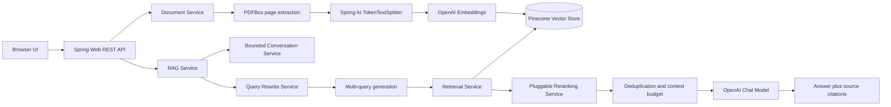
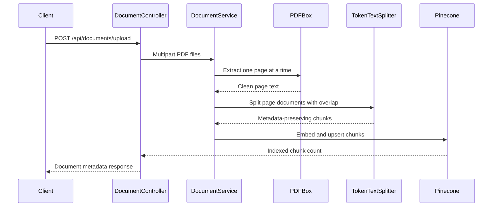
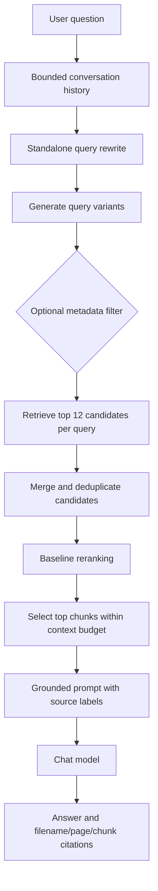

# Advanced Enterprise Document Intelligence System using Spring AI and Pinecone

A page-aware, conversational Advanced RAG API built with Java 17, Spring Boot 3.4, Spring AI 1.0, OpenAI, Pinecone, and PDFBox.

> Production-style enterprise document intelligence with page citations, metadata-aware retrieval, query rewriting, multi-query search, reranking, and conversational context.

## Architecture



### Document ingestion



### Advanced query pipeline



### Package structure

```text
com.example.rag
├── config       Spring AI clients, vector store, and RAG properties
├── controller   Document and RAG REST endpoints
├── exception    Consistent API error responses
├── model        Request, response, metadata, and citation records
└── service      Ingestion, retrieval, rewriting, reranking, memory, and RAG orchestration
```

## Quick start

1. Create a Pinecone index with the same dimensions as `text-embedding-3-small` (1536), and set its region/environment.
2. Set `OPENAI_API_KEY`, `PINECONE_API_KEY`, `PINECONE_ENVIRONMENT`, and `PINECONE_INDEX_NAME` in the environment. Optional model and RAG settings are documented in `application.yml`.
3. Run `mvn test` to compile and execute the test suite.
4. Run `mvn spring-boot:run`.
5. Open `http://localhost:8080` for the browser UI.
6. Upload PDFs with `POST /api/documents/upload` using multipart field `files`.
7. Ask with `POST /api/rag/ask` and JSON `{ "question": "...", "filters": { "documentId": "..." } }`.

For the repository-local Maven installation on Windows, use:

```powershell
& "C:\path\to\apache-maven\bin\mvn.cmd" test
& "C:\path\to\apache-maven\bin\mvn.cmd" spring-boot:run
```

## API

- `POST /api/documents/upload`: one or more PDFs
- `GET /api/documents`: ingested document summaries
- `DELETE /api/documents/{id}`: remove a document's vectors
- `POST /api/rag/ask`: stateless advanced RAG
- `POST /api/rag/chat`: conversational RAG; pass `conversationId`
- `GET /api/documents/{id}/sources`: source metadata for a document

Example request:

```bash
curl -X POST http://localhost:8080/api/rag/ask \
	-H "Content-Type: application/json" \
	-d '{"question":"What is the document retention period?","filters":{"documentType":"pdf"}}'
```

Example response:

```json
{
	"answer": "The retention period is ... [employee-policy.pdf, page 12].",
	"rewrittenQuery": "What is the document retention period?",
	"sources": [
		{"filename":"employee-policy.pdf","page":12,"chunkId":"..."}
	]
}
```

## Pipeline

Question -> conversation-limited rewrite -> multi-query generation -> Pinecone retrieval with metadata filters -> candidate deduplication -> reranking -> context budget filtering -> grounded prompt -> LLM -> answer and page citations.

Chunking uses Spring AI `TokenTextSplitter` with a configurable size and overlap. Larger chunks retain more local context but dilute retrieval precision; overlap protects facts that straddle boundaries but increases vector count and duplicate candidates.

Vector similarity is a strong recall mechanism, not a perfect final ranking: lexical matches, query intent, and duplicate/near-duplicate chunks can affect ordering. `RerankingService` is deliberately isolated so a cross-encoder or hosted reranker can replace the baseline later.

## Interview explanation

Basic RAG is `question -> retrieve relevant passages -> put passages in a prompt -> generate an answer`. Advanced RAG adds controls at each stage: rewriting resolves follow-up references, multi-query retrieval improves recall, metadata filters constrain the search space, reranking improves precision, and context filtering removes duplicates and stays within the model budget.

Pinecone is used because it provides managed, scalable nearest-neighbor search with metadata filters. Embeddings turn text and questions into vectors so semantically similar wording can match even when exact keywords differ. Page-aware chunks preserve citation boundaries. Chunk size trades context completeness against precision and vector cost; overlap protects boundary facts but can create duplicates.

Query rewriting turns a question such as “What are its advantages?” into a standalone query using bounded conversation history. Multi-query retrieval searches several paraphrases and unions the candidates. Reranking is needed because vector similarity measures embedding closeness, not necessarily exact intent, evidence density, or duplicate quality. Context compression/filtering keeps only distinct, relevant chunks under a character budget.

The grounded prompt tells the model to use retrieved facts, admit missing information, and cite filename and page. This reduces hallucination, but does not eliminate it; groundedness and citation correctness still need evaluation. RAG is usually preferable to fine-tuning for changing enterprise documents: the source remains updateable and inspectable, while fine-tuning changes model behavior rather than acting as a document index. Conversation memory is useful for follow-ups but is capped to prevent prompt growth and accidental overexposure.

Evaluation should report retrieval relevance (did the right source appear?), answer relevance (did it answer the question?), groundedness (are claims supported?), and citation correctness (do cited pages support the claims?). The fixture under `src/test/resources/evaluation/questions.json` is the starting point for automated checks.

## Evaluation

`src/test/resources/evaluation/questions.json` contains a small expected-source dataset. The service logs query, rewrite, candidate count, selected count, and response length without logging keys or document content. Evaluate retrieval relevance, answer relevance, groundedness, and citation correctness against that fixture.

## Security

Credentials and prompts stay in server-side configuration. Never commit `.env` files or API keys. The API returns source metadata only, not Pinecone internals.
